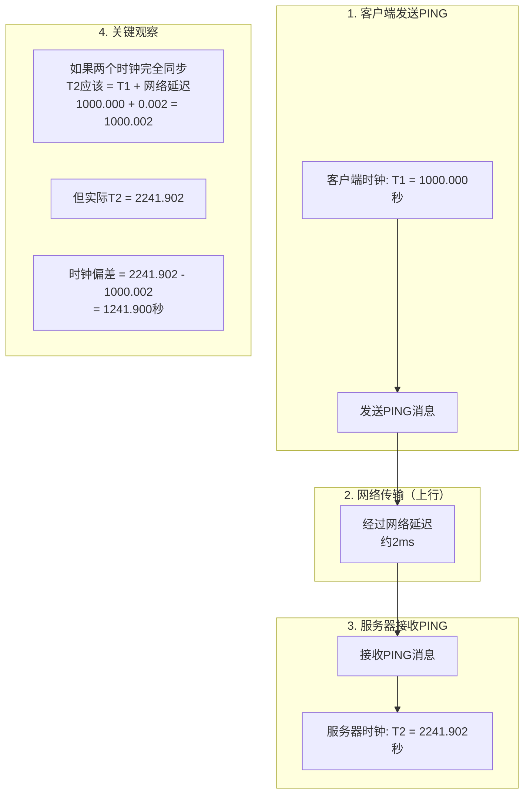
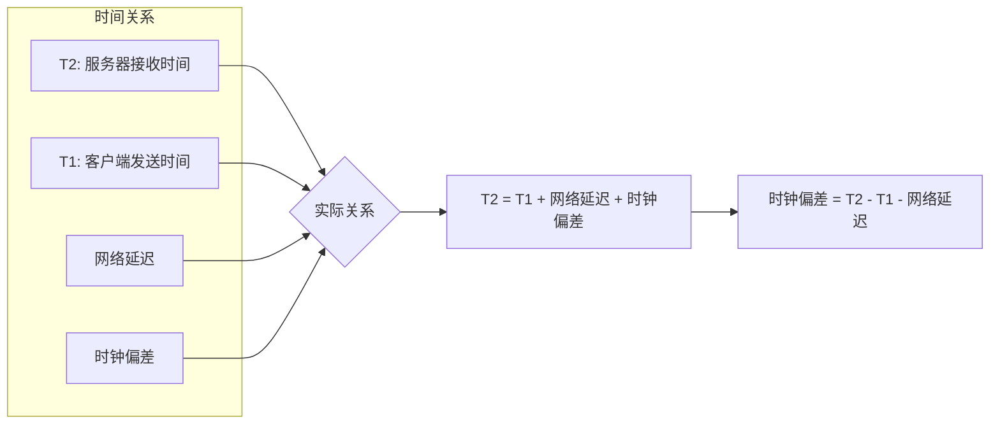
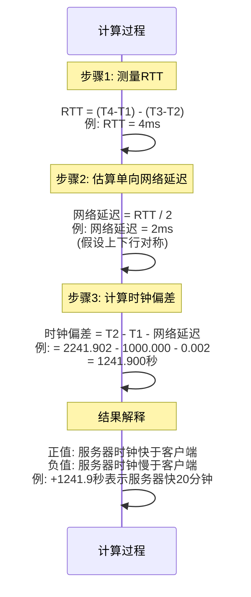
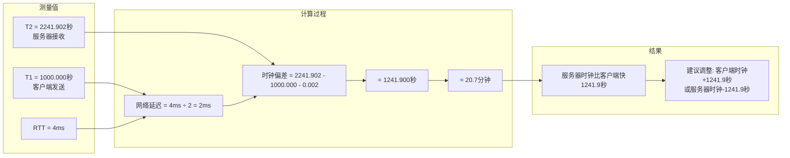
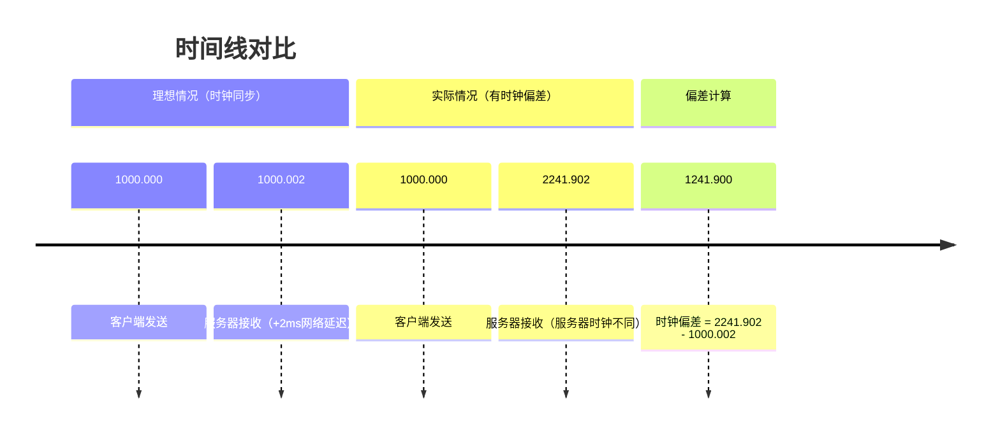

# 时钟偏差（Clock Deviation）计算原理图解

## 什么是时钟偏差？

时钟偏差是指两个设备的系统时钟之间的差异。在RTT测量中，我们可以精确计算出服务器时钟与客户端时钟的偏差。

## 计算原理图解



## 时钟偏差计算公式推导



## 详细计算步骤



## 实际例子（基于您的测量数据）



## 为什么需要减去网络延迟？



## 关键理解点

1. **时钟偏差 ≠ 简单的时间差**
   - 不能直接用 T2 - T1
   - 必须考虑网络传输时间

2. **为什么除以2？**
   - RTT包含上行和下行
   - 假设网络对称，单向延迟 = RTT/2

3. **精度影响因素**
   - 网络抖动
   - 服务器处理延迟
   - 时钟精度

4. **实际应用**
   - NTP协议使用类似原理
   - 分布式系统时间同步
   - 日志时间戳对齐

## 使用新名称后的输出示例

```
Clock Deviation (时钟偏差 Server - Client):
    Mean:          +1240.891 ms  
    Min:           +1240.560 ms
    Max:           +1243.560 ms
    Std Dev:          0.318 ms

时钟偏差解释：
- 正值（+）: 服务器时钟快于客户端
- 负值（-）: 服务器时钟慢于客户端
- 本例: 服务器比客户端快约1.24秒
```