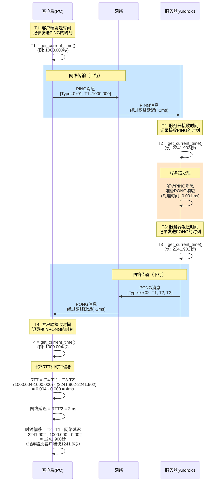

# RTT测量时序图

## 四个时间戳的形成过程



## 时间线视图

```mermaid
gantt
    title RTT测量时间线
    dateFormat X
    axisFormat %L
    
    section 客户端
    发送PING (T1)           :milestone, c1, 0, 0
    接收PONG (T4)           :milestone, c4, 4, 0
    
    section 网络
    上行传输                :active, n1, 0, 2
    下行传输                :active, n2, 2, 2
    
    section 服务器  
    接收PING (T2)           :milestone, s2, 2, 0
    处理请求                :crit, sp, 2, 0
    发送PONG (T3)           :milestone, s3, 2, 0
```



## 计算公式详解

### 1. RTT（往返时延）
```
RTT = (T4 - T1) - (T3 - T2)
    = 总往返时间 - 服务器处理时间
    = 纯网络往返延迟
```

### 2. 时钟偏移
```
Clock_Offset = T2 - T1 - Network_Delay
其中: Network_Delay = RTT / 2 (假设对称)
```

### 3. 实际数值示例（来自您的测量）
- T1 = 1000.000 (客户端时间)
- T2 = 2241.902 (服务器时间，快1241秒)
- T3 = 2241.902 (几乎无处理延迟)
- T4 = 1000.004 (客户端时间)

计算结果：
- RTT = 4ms
- 时钟偏移 = +1241秒
- 网络单向延迟 ≈ 2ms

## 使用说明

1. 将此文件在支持Mermaid的Markdown编辑器中打开
2. 或访问 https://mermaid.live 并粘贴mermaid代码块内容
3. 或在GitHub上直接查看（GitHub原生支持Mermaid）